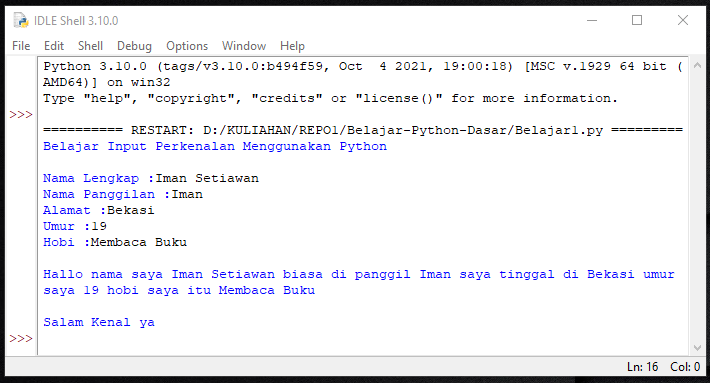

# Belajar-Python-Dasar
Belajar Python Dasar - Iman Setiawan

Ini adalah code python saya 
***
*print ("Belajar Input Perkenalan Menggunakan Python ")
*print ()
*nama = input("Nama Lengkap :")
*panggilan = input("Nama Panggilan :")
*alamat = input ("Alamat :")
*umur = input ("Umur :")
*hobi = input ("Hobi :")
*print ()
*print ("Hallo nama saya",nama,"biasa di *panggil",panggilan,"saya tinggal di"
        ,alamat,"umur saya",umur,"hobi saya itu",hobi)
*print ()
*print ("Salam Kenal ya")
***

Dan ini adalah hasil screenshot output nya.
